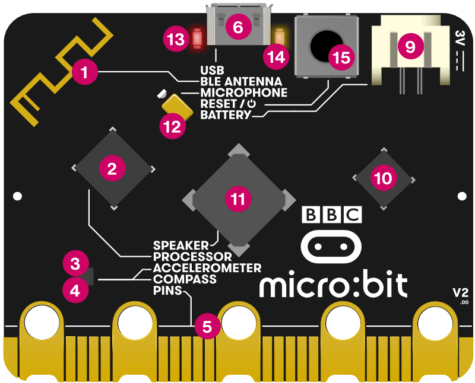

# Hello, I'm Simon!

# What is a micro:bit?

## What is a micro:bit?

{fig-align="center"}

## What is a micro:bit?

{fig-align="center"}

# Demo

Using MakeCode and Connecting

# Hands-On

Use MakeCode and Connect!

# Events

Make the micro:bit respond when something happens

# Variables

Store and count data on the micro:bit

# If Statements

Make something happen when something becomes true

# Random Numbers

# Challenge!

## Challenge!

Build a dice roller!

- Shake the micro:bit to "roll" a die
- Pick a random number from 1 to 6
- Use the LED matrix to show that many dots
- Play a sound if it rolls a 6
- Bonus: count the number of 6's and display when pressing the A button

