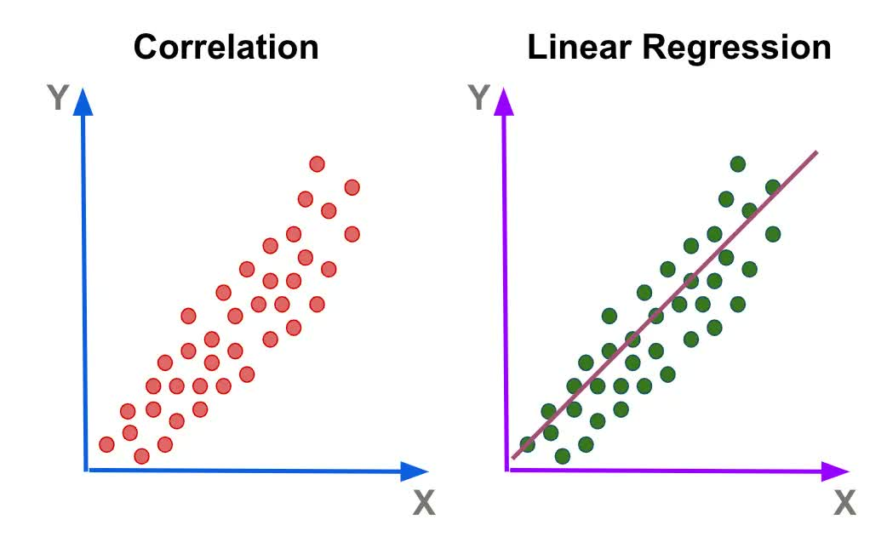

## Recap

- Learned about Pandas
- Created charts with Matplotlib
- Investigated data on Ulaanbaatar's air quality

# But, we did all the work ourselves!

# How can we use AI to detect the patterns in the data?

# Introducing scikit-learn

## What is scikit-learn?

- A Python library for **machine learning**
- Built on top of Pandas — works with DataFrames you already know
- Provides ready-to-use models for:
  - **Regression** — predicting a number (price, temperature, score)
  - **Classification** — predicting a category (spam/not spam, yes/no)
  - **Clustering** — finding hidden groups in data

## Using scikit-learn

- Every sklearn model follows the same three steps:

1. **Prepare** your features (`X`) and labels (`y`)
2. **Fit** — `model.fit(X, y)` — the model *learns* from your data
3. **Predict** — `model.predict(X_new)` — apply what it learned to new data

# Demo

Open and run the "Using Scikit-learn" Notebook (sklearn.ipynb)

# Hands-on

Open and run the "Using Scikit-learn" Notebook (sklearn.ipynb)

# Reflection

You created your first AI model!

# Let's use some real world data!

## Dzud

- For many families in Mongolia, livestock are the primary source of food, income, and cultural identity.
- Periodically, a combination of summer drought and extreme winter cold kills millions of animals in a single season. 
- This event is called a **dzud**. 
- In 2001 alone, over seven million animals died. Entire herding families were left with nothing.

# Video

[https://www.youtube.com/watch?v=GZiXZU9asNQ](https://www.youtube.com/watch?v=GZiXZU9asNQ){.external target="blank"}

# Can we use AI to predict an upcoming dzud?

# Demo

Open and run the "Finding Disasters" Notebook (finding_disasters.ipynb)

# Hands-on

Open and run the "Finding Disasters" Notebook (finding_disasters.ipynb)

# Reflection

What did you discover? Did anything surprise you?

# Finding The Cause

## Finding The Cause

- In the previous notebook you found the disasters. 
  - 2001 and 2010 were catastrophic years
  - Southern and western aimags tend to suffer more than others
- This tells use the *when* and *where* but not the *why*

# Demo and Walk Through

Open and run the "Finding The Cause" Notebook (finding_cause.ipynb)

# Let's Train Our Model!

## Let's Train Our Model!

- Winter temperature is the strongest predictor of livestock mortality
- A prior summer drought increases mortality
- Can a machine learn that relationship?
- And then predict mortality for future years?
- This is called **linear regression**

## What is Linear Regression?

- It draws the **best-fit straight line** through your data points
- Once the line is drawn, you can **predict new values**
- "Linear" just means the relationship is a straight line

## What is Linear Regression?

::: {style="text-align:center"}
{style="width:80%; margin:0"}
:::

## Training and Test Datasets

- We split our data into two groups: 
  - A **training set** to teach the model, and a **test set** to check how well it learned
- The test set is like an exam at the end to see if the model is working
- A common split is **80% training / 20% testing**

# Demo

Open and run the "Linear Regression" Notebook (regression.ipynb)

# Hands-On

Open and run the "Linear Regression" Notebook (regression.ipynb)

# Reflection

Congratulations! You trained your first AI model!

## Tomorrow

- Use the same approach for hardware
- Explore micro:bit boards
- Use AI to detect waving, putting your hand up, and other commands!