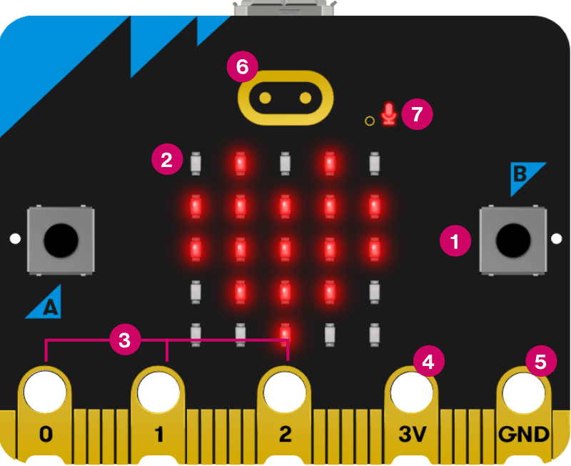
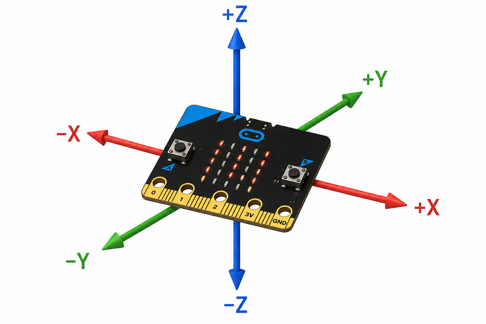
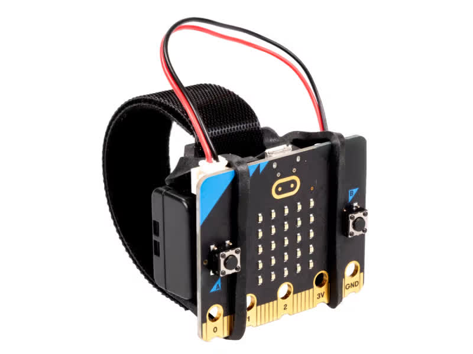
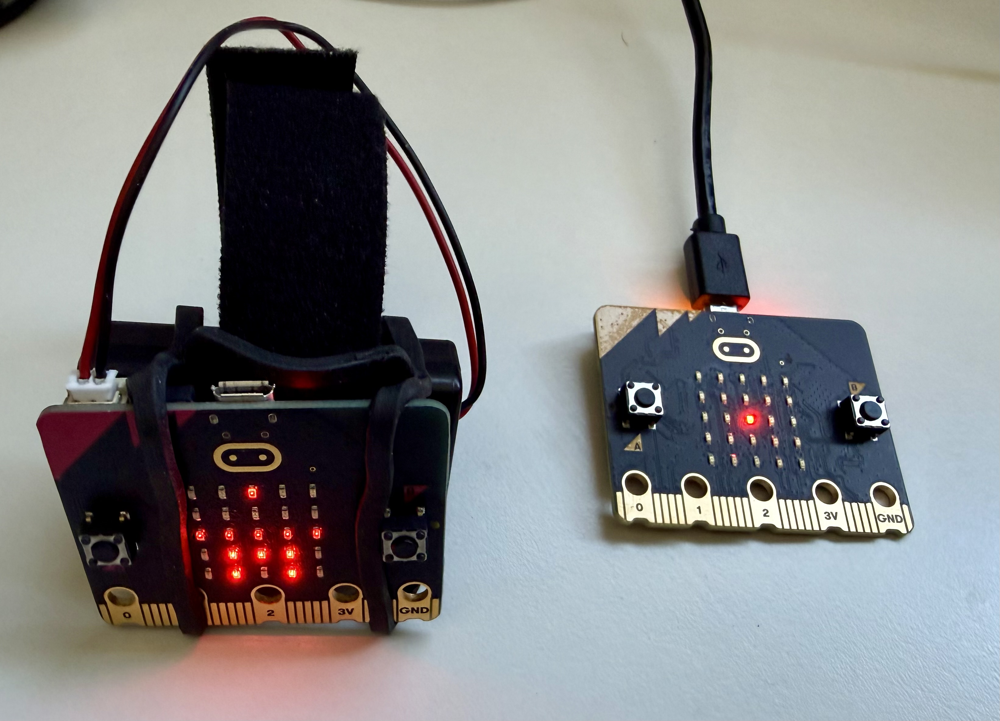
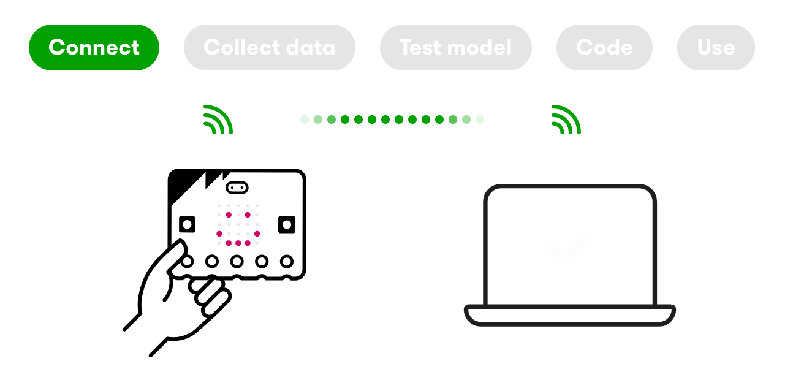
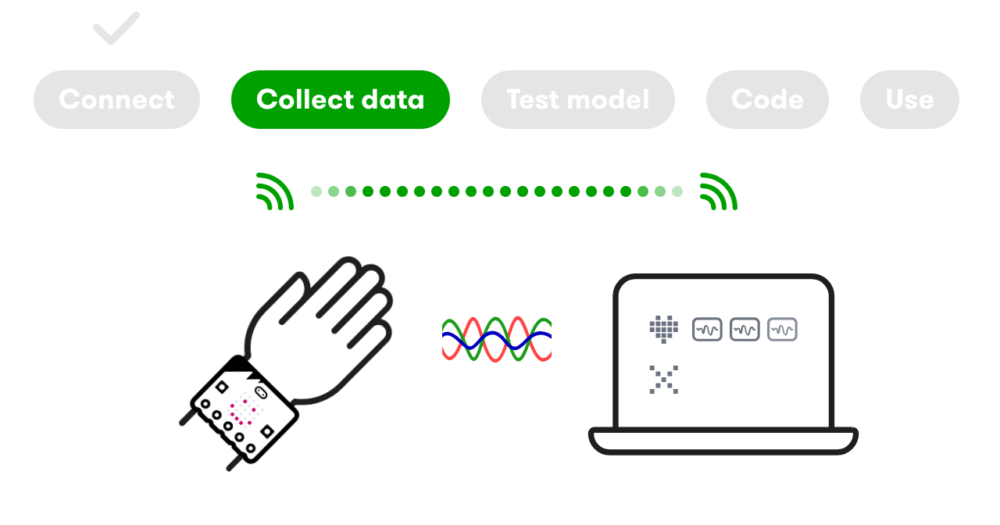
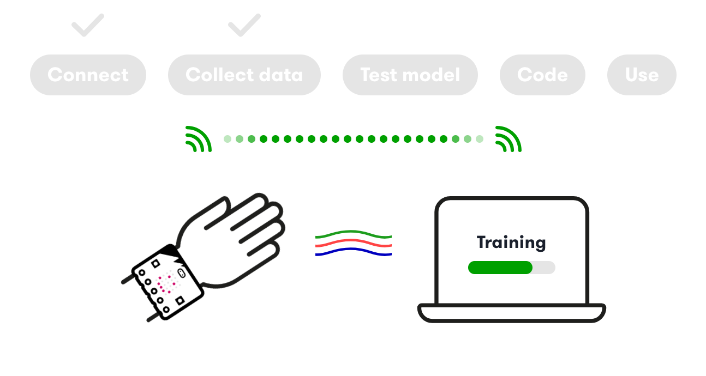
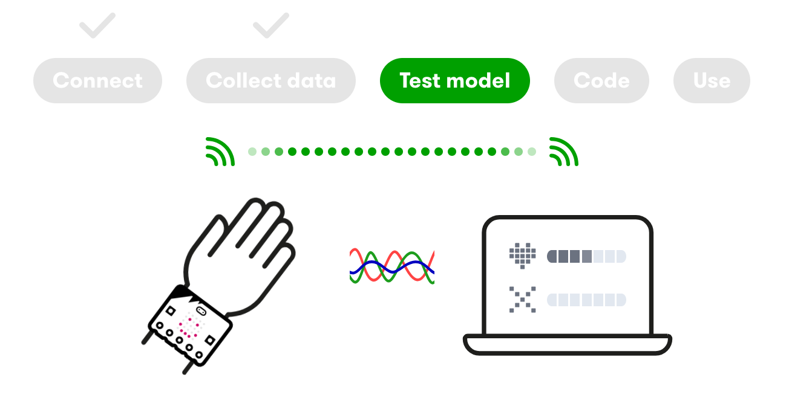
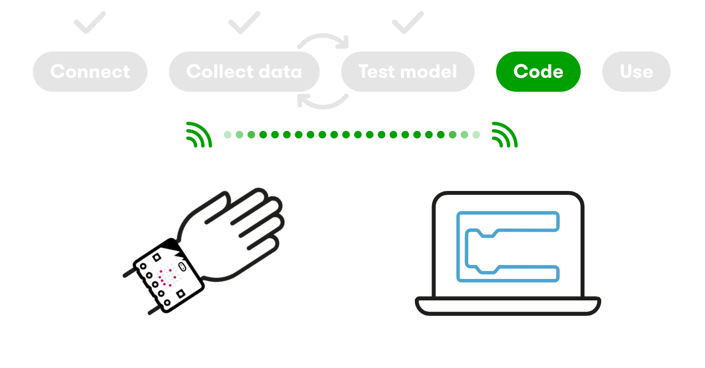

## Recap

- Used scikit-learn, Python's machine learning library
- Explored Linear Regression and KNN Classification Models
- Applied them to a "World Cup Challenge"
- Learned about data and models that could predict a Dzud

## AI in the Physical World

- Today, we'll bring what we've learned into the physical world
- Learn how AI models work in fitness trackers and other devices
- Do all of this using a **micro:bit**

# What is a micro:bit?

## What is a micro:bit?

{fig-align="center"}

## What is a micro:bit?

{fig-align="center"}

## What is an Accelerometer?

- A small chip that measures acceleration
  - How fast moves from one speed to another
- Measures acceleration in 3 directions: X, Y, and Z
  - Measures both positive and negative direction

## What is an Accelerometer?

{fig-align="center"}

# *But...  If the micro:bit is plugged in, how do we move it around?*

## Introducing the micro:bit Wearable!

{fig-align="center"}

## Introducing the micro:bit Wearable!

{fig-align="center"}

# Our Plan

## Our Plan

{fig-align="center"}

## Our Plan

{fig-align="center"}

## Our Plan

{fig-align="center"}

## Our Plan

{fig-align="center"}

# Demo

Connecting the micro:bit devices

## Hands-on

- Find someone to work with! (Pairs)
- Pickup two micro:bits (one with and one without wearable)
  - It doesn't matter who gets which one to start
- Get to the "graph" stage

# Walkthrough

Visit [https://createai.microbit.org](https://createai.microbit.org){.external target="blank"}

<!-- - Create a project: "My First Project"
- Click on "Connect using micro:bit radio instead"
- Connect the collector (wearable) micro:bit and click "Next"
- Select the micro:bit connection from the the popup
- Disconnect and **very gently** insert the battery wire
- (Pause to make sure everyone sees smiley face)
- Next, connect the receiver micro:bit and click "Next"
- Select the connection again from the popup
- Put the wearable on one of your wrists (don't worry who is first, you'll both have a turn to collect data)
- Check that the graphs are moving correctly! Yes, you are connected and ready to record! -->

# Walkthrough

Record an Action. (Make sure your band is tight!)

<!-- - Create an action: "Waving"
- Record and repeat three times
- Pass the wearable to your partner. Have them record a different action. You can pick which action. Make sure your band is tight and don't hit anyone!
- (Pause to make sure everyone has two actions)
- Let's do another two. (One per person)
- (Pause to make sure everyone has four actions) -->

# Hands-On

Go ahead and record 4 or 5 actions. Take turns in wearing the wearable.

# Hands-On

When you have all the actions, click on the "Train model" button.

# Hands-On

Take turns and test your actions. How well did the model learn? What happened if you just let your hand do nothing?

# Discussion

What worked well? What didn't work well? Or what did it get wrong?

# Hands-On

Click "Edit Data Samples" button to add more data. Add an action for being still (if you don't already have one).

# Diverse Data

## What is Diverse Data?

- AI models learn patterns from the data they are trained on
- If training data only reflects a narrow group, the model only works well for that group
- **Diverse data** includes variation in people, environments, styles, and conditions
- The more diverse the data, the more fairly and reliably the model performs

## Without Diverse Data: Facial Recognition

- In 2018, researcher Joy Buolamwini studied commercial facial recognition tools
- She found they worked well for lighter-skinned men...
- ...but had error rates up to **35% higher** for darker-skinned women
- Why? The models were trained mostly on lighter-skinned male faces
- They simply hadn't seen enough diverse examples to learn properly

## Without Diverse Data: Voice Assistants

- Early voice assistants (Siri, Alexa) struggled with non-standard accents and dialects
- They were trained mostly on a narrow range of voices
- People with regional accents, non-native speakers, or less common dialects were often misunderstood
- This is slowly improving — but only because companies added more diverse training data

## Testing Diversity of our Data

- Take off the micro:bits and leave both of them on the table
- Make sure you are in the "Testing Model" screen
- Swap desks with another pair close to you
- Take turns to put on their micro:bit and test their actions

# Discussion

What did you find? Did they work as you expected?

# Reflection

What did you learn today? Was using AI easier or harder than you thought?

## Disconnecting the micro:bit

- Disconnect your receiver micro:bit and leave on the desk
- Leave your wearable micro:bit connected to the battery pack
  - I will disconnect this for you. (These can be easy to break)

## Our Plan

{fig-align="center"}

## Our Plan

{fig-align="center"}

## Our Plan

- Work with the same person as yesterday
- Pick up a wearable micro:bit and a radio micro:bit
- Use the same laptop as you did yesterday
  - (Your actions will saved on this machine)
- Go to [https://createai.microbit.org](https://createai.microbit.org)
- Wait for instructions!

# Demo

Connect, Test Actions, and Edit in MakeCode

<!-- - You'll have to connect again. Remember to use the micro:bit radio option.
- And the first micro:bit to connect is the wearable
- After connecting, a quick test to make sure that the actions are still being recognized
- (Pause for the class to catchup) -->

## On Start Functions

```
def on_on_start():
    basic.show_icon(IconNames.HOUSE)
ml.on_start(ml.event.waving, on_on_start)

def on_on_start2():
    basic.show_icon(IconNames.DUCK)
ml.on_start(ml.event.writing, on_on_start2)

# ...and so on for other actions
```

## On Start Functions

```
def on_on_start2():
    basic.show_icon(IconNames.DUCK)
    music.play(music.builtin_playable_sound_effect(soundExpression.slide), music.PlaybackMode.UNTIL_DONE)
ml.on_start(ml.event.writing, on_on_start2)
```

# Hands-on

Connect, Test Actions, and Edit in MakeCode

# Demo

Downloading to your micro:bit

<!-- - When you want to test it on your micro:bit...
- Click on the download button
- Follow the prompts to disconnect the radio micro:bit
- Plug in the wearable micro:bit. You can keep the battery connected.
- Wait for the model to download
- Disconnect the wearable from the USB
- Test your code! -->

# Hands-on

Downloading to your micro:bit

## Tomorrow

- Explore more functions to run on the micro:bit
- Create a mini-project
  - For example, exercise app, step counter, or a fitness tracker
- Show and share


