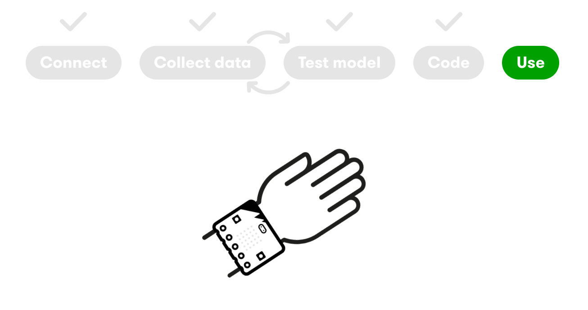

## Recap

- Used the micro:bit and Create AI
- Trained and tested a series of actions
- Learned about the importance of diverse data

## Our Plan

{fig-align="center"}

## Our Plan

{fig-align="center"}

## Our Plan

- Work with the same person as yesterday
- Pick up a wearable micro:bit and a radio micro:bit
- Use the same laptop as you did yesterday
  - (Your actions will saved on this machine)
- Go to [https://createai.microbit.org](https://createai.microbit.org)
- Wait for instructions!

# Demo

Connect, Test Actions, and Edit in MakeCode

<!-- - You'll have to connect again. Remember to use the micro:bit radio option.
- And the first micro:bit to connect is the wearable
- After connecting, a quick test to make sure that the actions are still being recognized
- (Pause for the class to catchup) -->

## On Start Functions

```
def on_on_start():
    basic.show_icon(IconNames.HOUSE)
ml.on_start(ml.event.waving, on_on_start)

def on_on_start2():
    basic.show_icon(IconNames.DUCK)
ml.on_start(ml.event.writing, on_on_start2)

# ...and so on for other actions
```

## On Start Functions

```
def on_on_start2():
    basic.show_icon(IconNames.DUCK)
    music.play(music.builtin_playable_sound_effect(soundExpression.slide), music.PlaybackMode.UNTIL_DONE)
ml.on_start(ml.event.writing, on_on_start2)
```

# Hands-on

Connect, Test Actions, and Edit in MakeCode

# Demo

Downloading to your micro:bit

<!-- - When you want to test it on your micro:bit...
- Click on the download button
- Follow the prompts to disconnect the radio micro:bit
- Plug in the wearable micro:bit. You can keep the battery connected.
- Wait for the model to download
- Disconnect the wearable from the USB
- Test your code! -->

# Hands-on

Downloading to your micro:bit

# Project Time!

## What Will You Create?

- Fitness tracker
  - Count the number of arm raises and display on the LED
- Clapper
  - Clap to switch on / off the LEDs or play a sound
- Safe driving app
  - Detect between holding the steering wheel and texting
- Or your own idea!

# Reflect and Share

What did you build? How does it work?