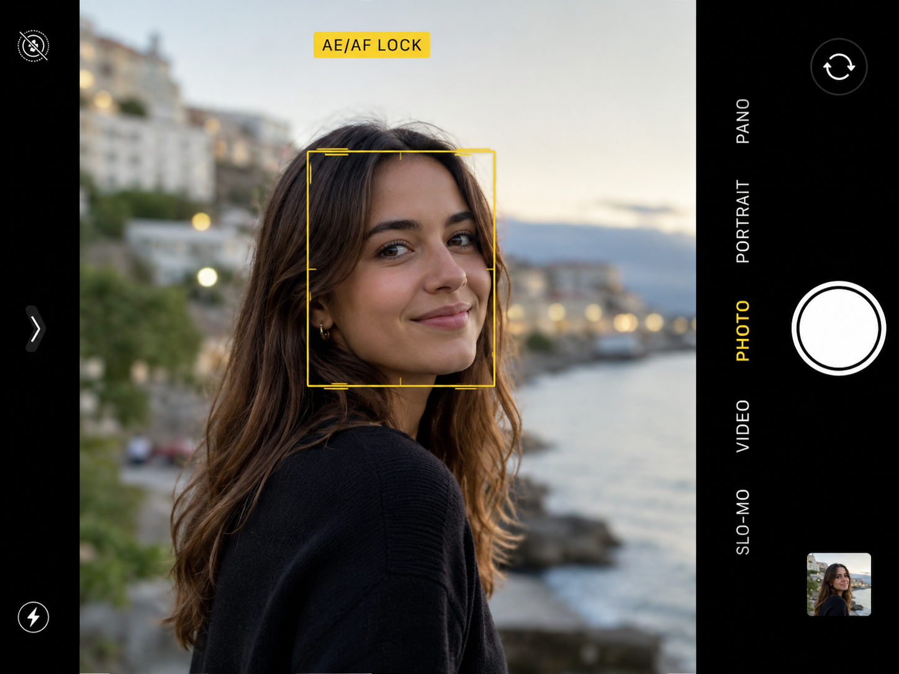
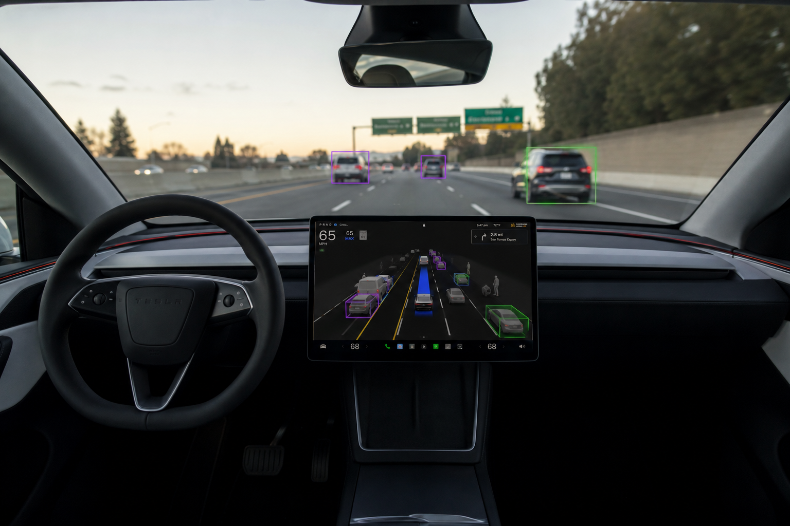
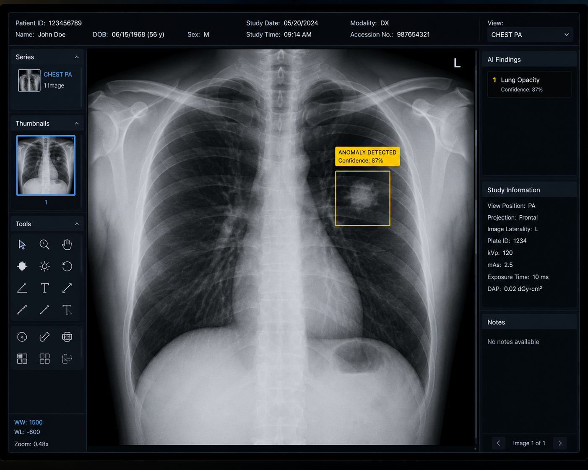

## What Is a Neural Network?

- A computing system loosely **inspired by the human brain**
- Made up of layers of connected **nodes** (neurons)
  - **Input layer**: receives raw data (numbers, pixels, text)
  - **Hidden layers**: find patterns in that data
  - **Output layer**: produces the final prediction
- Each connection has a **weight** — how much does one neuron influence the next?
- Stack enough layers and the network can learn almost anything

# Neural Network Demo

## Will I Do Well on My Test?

```{=html}
<iframe src="../components/nn.html" allowtransparency="true" width="100%" height="600px" style="border:none; background:transparent;"></iframe>
```

# Hands-On

Try out the neural network yourself

# Reflection

Did the neural network produce the results you expected?

# Computer Vision is Everywhere

## Computer Vision is Everywhere

{fig-align="center"}

## Computer Vision is Everywhere

{fig-align="center"}

## Computer Vision is Everywhere

{fig-align="center"}

# How Do Computers See?

## How Do Computers See?

- Computers see images as **grids of numbers** — pixels
- Each pixel is a number from 0–255 (or 3 numbers for color: R, G, B)
- A 640×480 photo = nearly **1 million numbers**
- The challenge: how do we find meaning in all those numbers?

## How Do Computers See?

- Answer: A special type of neural network called a **Convolutional Neural Network** or a **CNN**
  - Takes in an image
  - Detects edges, corners, and other shapes
  - Returns results on what it sees and where

## How Do Computers See?

- Many types of computer vision algorithms:
  - **Face Detection** (is there a face in the picture?)
  - **Object Detection** (what is in this image and where?)
  - **Pose Estimation** (where are the body parts?)
  - **Gesture Recognition** (what hand gesture is this?)
  - **Image Segmentation **(what pixel belongs to what object?)

## Face Detection

- **Question**: "Is there a face in this image, and *where* is it?"
- Detects **faces** and draws bounding boxes around each one
- Not facial recognition!
- Used in:
  - Camera autofocus algorithms
  - Security cameras detecting people in the scene
  - Counting people attending an event

# Demo

Face Detection Notebook

# Hands-On

Face Detection Notebook

***

## Object Detection

- **Question**: "What is in this image, and *where* is it?"
- Detects **multiple objects** and draws bounding boxes around each one
- Examples:
  - Self-driving cars spotting pedestrians and vehicles in real time
  - Security cameras flagging suspicious activity
  - Counting inventory in a warehouse automatically

## Pose Estimation

- **Question**: "Where are the body parts?"
- Detects **key landmarks** on a person — joints, hands, face points
- Examples:
  - Fitness apps checking your squat form
  - Video games that respond to your movement (no controller needed)
  - Physical therapy tools tracking patient recovery
- We'll use MediaPipe for this in our notebooks

## Gesture Recognition

- TBD

## Image Segmentation

- **Question**: "Which pixel belongs to which object?"
- Goes beyond bounding boxes — labels **every single pixel**
- Examples:
  - Medical imaging — precisely outlining a tumor for surgeons
  - Photo apps removing backgrounds with one tap
  - Autonomous vehicles painting a full picture of the road scene