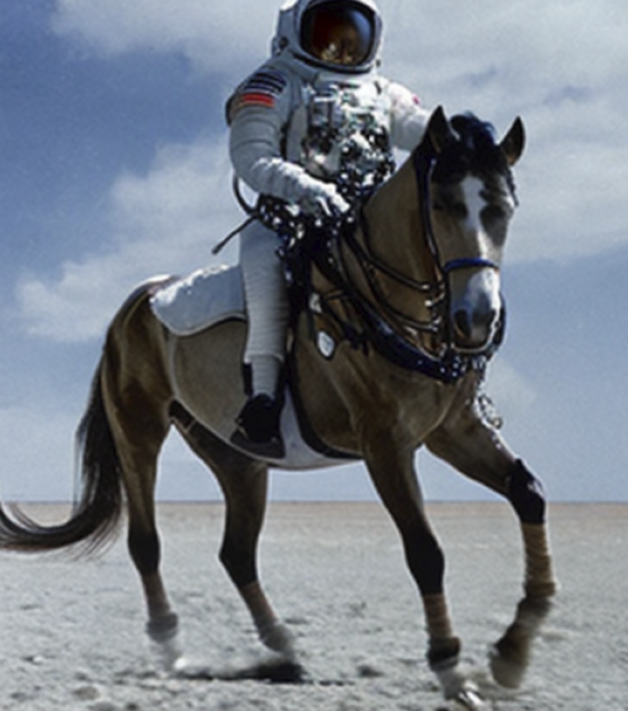

## Recap

- Introduced to Generative AI
- Used the OpenAI SDK to chat with a model
- Explored structured output for piano and 3D scenes

# Image Generation

:::: {.columns}

::: {.column width="50%"}
"A photograph of an astronaut riding a horse."

- Based on a concept called a diffusion transformer
- Commonly known as a **diffuser**
- Two stage process, inspired by thermodynamics
:::

::: {.column width="50%"}

:::
::::

## Introducing the Diffuser

- Training
  - During training, random noise is added to images in steps
  - Model learns to predict what noise was added (forward diffusion process)
- Generation (process runs in reverse)
  - Start with pure random noise
  - Model estimates what noise should be removed to create a realistic image
  - Using the text prompt, the model steers the process towards images that match the description

## Introducing the Diffuser



## Prompting for Images

- Key components to include in prompts:
  - **Subject**: What you want
  - **Style/Medium**: photorealistic, oil painting, digital art
  - **Lighting**: studio lighting, dramatic shadows, soft diffused
  - **Composition**: close-up, wide-angle, rule of thirds
  - **Quality**: highly detailed, 4K, sharp focus
  - **Technical specs**: 85mm lens, f/1.8, bokeh

# Demo

Image Generation Notebook

# Hands-On

Image Generation Notebook

# Reflection

How was the quality of the images? Was it better or worse than you thought?

## Image to Image

- Similar process to image generation, but the input is an image instead of text
- Often used to transform or restyle existing images
- Model requires an input image and a guiding text prompt
  - Example: "Turn this image into an anime drawing"

# Demo

Image-to-Image Notebook

# Hands-On

Image-to-Image Notebook

# Generative AI for Image Understanding

## Generative AI for Image Understanding

- Generative AI models can also identify and understand the content of images
- These types of models are called **VLMs** or **Vision Language Models**

## VLMs vs. CNNs

- Earlier this week, we used CNNs for our computer vision models
- CNNs are basic detectors for objects, poses, segments, etc.
- VLMs produce more descriptive language about what they see in images

# Demo

VLM Notebook

# Hands-On

VLM Notebook

## More with VLMs

- Not only can VLMs describe images, but you can also ask questions about the image
  - "Read the text in the image"
  - "How many people in this image have red shirts?"
  - "Is the person in this image wearing glasses?"
- This concept is known as *reasoning* and can be very powerful

# Demo

Reasoning with VLMs

# Hands-On

Reasoning with VLMs

## Using Assistive VLMs

- Millions of people around the world live with visual impairments. 
- Assistive technology — screen readers, braille displays, and now AI — helps them navigate daily life independently.
- Combined with audio output, VLMs can help transcribe scenes and other details

## Using Assistive VLMs

- A VLM-powered seeing assistant has three steps:
  - **Capture**: The camera takes a photo of the surroundings
  - **Describe**: The VLM generates a short, clear description
  - **Speak**: Text-to-speech reads the description aloud

# Demo

VLMs as Assistive Technology

# Hands-On

VLMs as Assistive Technology

## Tomorrow

- Our Last Day!
- Which means our Final Project!!!
- You get the chance to use anything that we've learned over the past 2 weeks!